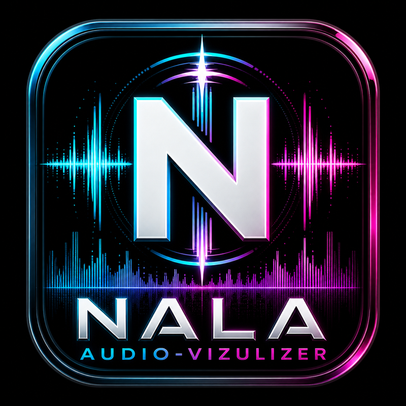
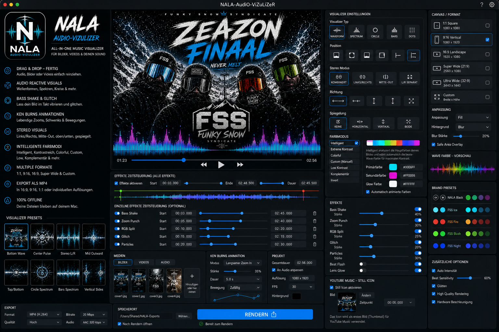

# NALA-AudiO-ViZuLiZeR

Native macOS music visualizer for turning audio plus cover art into social-ready visualizer videos.



## macOS Preview



## What It Does

- Import audio by drag and drop, button, or double-click.
- Import images and videos into a media tray.
- Remove accidentally imported audio, images, and videos with `X` controls.
- Pick a YouTube Music / still-cover image.
- Adjust cover art with zoom, rotation, and X/Y offset.
- Choose canvas formats: `1:1`, `9:16`, `16:9`, and `Super Wide`.
- Render either a bottom waveform or block stereo bars.
- Control visualizer transparency, bar count, and visualizer height.
- Set a custom export file name.
- Export MP4 through macOS AVFoundation / VideoToolbox.

## Current macOS Build

A test DMG is included for quick installation:

[dist/NALA-AudiO-ViZuLiZeR.dmg](dist/NALA-AudiO-ViZuLiZeR.dmg)

Open the DMG and drag `NALA-AudiO-ViZuLiZeR.app` into `Applications`.

## Build From Source

Requirements:

- macOS 14 or newer
- Xcode 26 / Swift 6 toolchain or newer

Build:

```bash
swift build -c release
```

Run from source:

```bash
swift run
```

The app exports videos to:

```text
~/Movies/NALA-Exports
```

## Export Naming

Use the `Dateiname` field in the export bar. The app sanitizes invalid filename characters automatically. If a file already exists, the export is saved with a suffix such as `-2` or `-3`.

## Roadmap

- Proper native Metal renderer for the macOS preview and export path.
- More visualizer types: circle spectrum, dots, side waves, hybrid modes.
- Video backgrounds and multi-image slideshow projects.
- Better FFT beat detection and frequency band controls.
- Preset/project save and load UI.
- Notarized macOS release.
- Windows and Ubuntu ports with GPU acceleration.

See [PORTING_PLAN.md](PORTING_PLAN.md) for the Windows/Linux GPU strategy.

## License

This repository uses a dual-license strategy:

- Community/open-source use: GNU AGPL-3.0-or-later, see [LICENSE](LICENSE).
- Proprietary or closed commercial apps based on this work require a separate commercial license from Master-MD.

Important: AGPL is a real open-source license. It allows commercial use when the license terms are followed. If someone wants to build a closed/proprietary commercial product from this project without AGPL obligations, they need a separate commercial agreement.

Attribution is required through the AGPL copyright notices and the project [NOTICE](NOTICE.md).

This is not legal advice. For stronger protection of the product idea, brand, commercial licensing terms, or royalties, consult an IP/software licensing lawyer.
